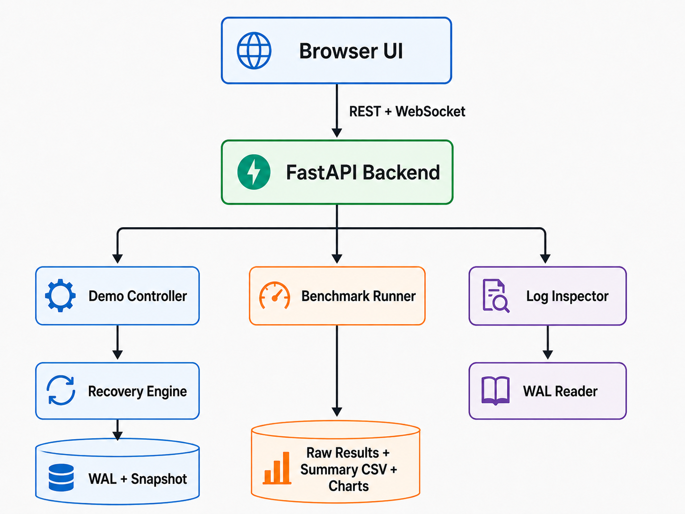

# RTO Disaster Recovery Benchmark

Dự án #99: benchmark Recovery Time Objective (RTO) và trình mô phỏng trực quan cho crash recovery trong một hệ thống distributed database giả lập.

Dự án đo cách checkpoint interval ảnh hưởng đến recovery time sau khi một node bị crash. Source code bao gồm Python recovery engine, FastAPI backend, realtime WebSocket events, browser UI, benchmark runner, data generators và các tài liệu báo cáo.

> Đây là simulator phục vụ học thuật để nghiên cứu WAL, checkpointing, redo/undo recovery và distributed transaction recovery. Đây không phải production database.

## Tính Năng Chính

- Binary write-ahead log (WAL) với các record `START`, `UPDATE`, `COMMIT`, `ABORT`, `BEGIN_CHECKPOINT`, `END_CHECKPOINT`, `PREPARE` và `READY`.
- Snapshot storage model trong đó mỗi page được biểu diễn bằng một số nguyên 64-bit.
- Recovery manager có Analysis, Partial Redo, Global Undo, checkpoint failure handling và in-doubt transaction resolution.
- Two-phase commit simulation thông qua coordinator decisions cho prepared/in-doubt transactions.
- FastAPI backend với REST endpoints và WebSocket event streaming.
- Browser UI cho recovery demo, benchmark execution và WAL inspection.
- Benchmark pipeline cho ma trận checkpoint interval x run.
- Raw benchmark output, aggregated summary CSV và chart generation có thể tái lập.
- Pytest suite bao phủ WAL, recovery, API, benchmark và data generation behavior.

## Kiến Trúc Hệ Thống



Các thư mục chính:

| Path         | Vai trò                                                                                           |
| ------------ | ------------------------------------------------------------------------------------------------- |
| `src/`       | Core logic cho WAL, snapshot, checkpoint, recovery, crash, coordinator và integrity.              |
| `api/`       | FastAPI app, REST routers, shared runtime state và WebSocket event manager.                       |
| `ui/`        | Static HTML/CSS/vanilla JavaScript UI cho demo, benchmark và log inspection.                      |
| `benchmark/` | Benchmark runner, statistics analyzer, cost model và chart generator.                             |
| `data_gen/`  | Random dataset generator, full-scale dataset generator và các curated demo scenarios.             |
| `docs/`      | Architecture report, source reading guide, analysis report, demo script và presentation notes.    |
| `tests/`     | Pytest suite cho core logic, API behavior, benchmark flow và data generation.                     |
| `results/`   | Raw benchmark outputs, summaries và chart artifacts được sinh ra trong quá trình chạy benchmark.  |

## Recovery Flow

Logic recovery trung tâm nằm trong `src/recovery/recovery_manager.py`.

Ở mức tổng quan, recovery chạy qua các phase sau:

1. **Analysis**
   - Đọc WAL records.
   - Tìm checkpoint hợp lệ mới nhất.
   - Phân loại transactions thành committed, aborted, loser hoặc in-doubt.

2. **Checkpoint Failure Detection**
   - Phát hiện các `BEGIN_CHECKPOINT` không có `END_CHECKPOINT` hợp lệ theo sau.
   - Bỏ qua incomplete checkpoints và fallback về checkpoint hợp lệ gần nhất.

3. **Partial Redo**
   - Replay committed updates từ recovery start LSN.
   - Ghi giá trị `after_image` vào snapshot.

4. **Global Undo**
   - Duyệt WAL theo chiều ngược lại.
   - Undo loser hoặc aborted transactions bằng cách khôi phục giá trị `before_image`.

5. **In-Doubt Transaction Handling**
   - Resolve prepared/ready transactions thông qua coordinator simulator.
   - Transactions được coordinator quyết định `COMMIT` sẽ được redo; `ABORT` sẽ được undo.

6. **RTO Measurement**
   - Đo recovery duration.
   - Emit realtime events cho UI.

## Cài Đặt

```bash
pip install -r requirements.txt
```

## Chạy Web App

```bash
python run.py
```

Các URL local mặc định:

- Demo dashboard: <http://127.0.0.1:8000/demo>
- Benchmark dashboard: <http://127.0.0.1:8000/benchmark>
- WAL log inspector: <http://127.0.0.1:8000/logs>
- Health check: <http://127.0.0.1:8000/api/health>

Health check từ terminal:

```bash
curl http://127.0.0.1:8000/api/health
```

## Chạy CLI Recovery Smoke Test

```bash
python src/main.py --crash-and-recover --interval 5
```

Lệnh này sinh workload WAL/snapshot mẫu, giả lập crash, chạy recovery và báo cáo thông tin RTO.

## Chạy Benchmarks

```bash
python benchmark/benchmark_runner.py --intervals 1 2 5 10 20 30 --runs 10 --seed 42
```

Benchmark output:

- Raw per-run JSON files: `results/raw/`
- Aggregated summary: `results/summary.csv`
- Các summary fields gồm mean, median, p99, standard deviation, I/O cost, CPU cost, communication cost và theoretical RTO.

Sinh charts:

```bash
python benchmark/chart_generator.py
```

Sinh full-scale dataset:

```bash
python data_gen/generate_full_scale_dataset.py --output-dir data/full_scale
```

## Chạy Tests

```bash
pytest tests/ -v
```

## Tổng Quan API

Các endpoint chính:

| Endpoint           | Vai trò                                                                                       |
| ------------------ | --------------------------------------------------------------------------------------------- |
| `GET /api/health`  | Health check.                                                                                 |
| `/api/demo/*`      | Load scenarios, configure demo data, crash node, recover node và inspect recent logs.          |
| `/api/benchmark/*` | Start benchmark jobs, check status và đọc benchmark results.                                  |
| `/api/logs/*`      | Inspect WAL records.                                                                          |
| `GET /ws/events`   | Realtime event stream cho UI updates.                                                         |

## Màn Hình UI

- `/demo`: interactive crash và recovery demo.
- `/benchmark`: benchmark execution và result visualization.
- `/logs`: WAL record inspector.

UI được triển khai bằng static HTML/CSS và vanilla JavaScript trong `ui/`.

## Thứ Tự Đọc Source Code Đề Xuất

Để hiểu codebase nhanh nhất, nên đọc các file sau trước:

1. `README.md`
2. `run.py`
3. `api/app.py`
4. `src/log/log_record.py`
5. `src/storage.py`
6. `src/checkpoint/checkpoint_manager.py`
7. `data_gen/generate_logs.py`
8. `src/recovery/recovery_manager.py`
9. `api/routers/demo.py`
10. `benchmark/benchmark_runner.py`

Hướng dẫn chi tiết: [`docs/source_reading_guide.md`](docs/source_reading_guide.md)

## Tài Liệu

- [`docs/architecture_report.md`](docs/architecture_report.md): báo cáo kiến trúc hệ thống.
- [`docs/source_reading_guide.md`](docs/source_reading_guide.md): thứ tự đọc source code và các logic quan trọng.
- [`docs/design_document.md`](docs/design_document.md): ghi chú thiết kế.
- [`docs/analysis_report.md`](docs/analysis_report.md): báo cáo phân tích benchmark.
- [`docs/demo_script.md`](docs/demo_script.md): kịch bản quay màn hình/demo.
- [`docs/presentation_outline.md`](docs/presentation_outline.md): dàn ý thuyết trình.
- [`docs/data_generation_guide.md`](docs/data_generation_guide.md): hướng dẫn sinh dữ liệu.

## Trạng Thái Dự Án

Implementation hiện tại bao gồm core recovery engine, API layer, WebSocket stream, demo UI, benchmark UI, WAL inspector, data generators, benchmark pipeline, documentation artifacts và automated tests.

Mô hình hiện tại cố ý đơn giản hóa database internals thực tế. Snapshot pages là scalar values, checkpoint metadata được nén gọn, và WAL scanning được thiết kế cho simulator-scale workloads thay vì production-scale log processing.
