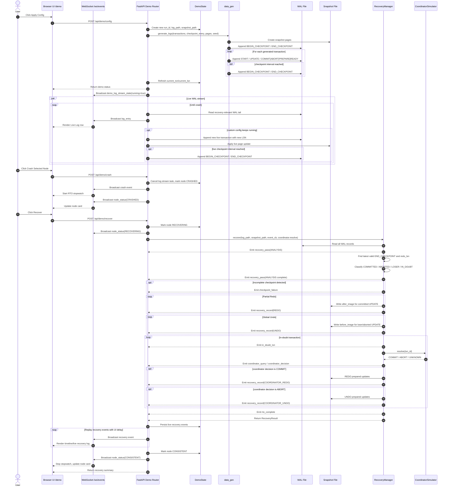
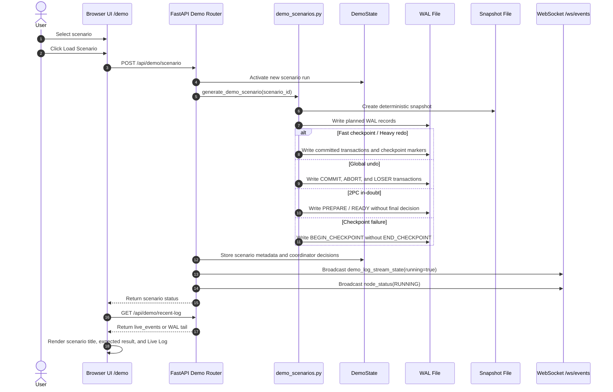
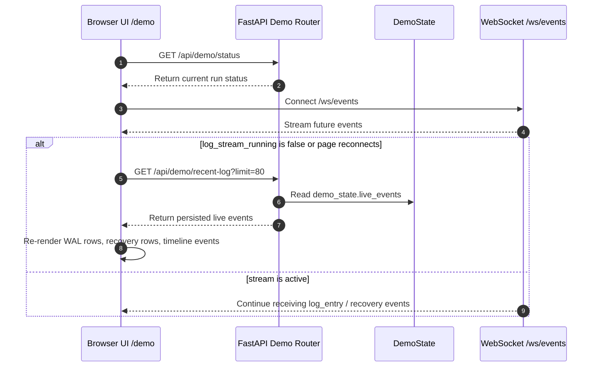
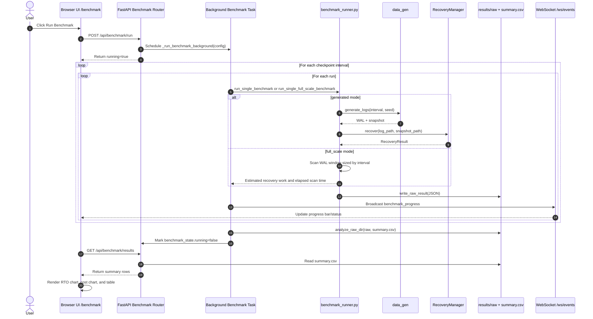
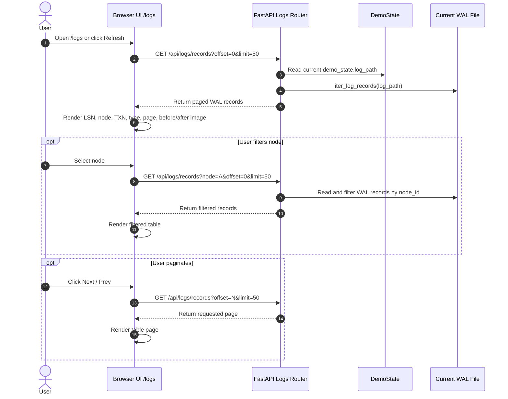

# Mermaid Sequence Diagrams

Tài liệu này mô tả các luồng runtime chính của project hiện tại bằng Mermaid sequence diagram.

## 1. Demo Flow: Apply Config, Live Log, Crash, Recover

## 2. Scenario Flow: Load Curated Scenario

## 3. Live Log Hydration And Reconnect

## 4. Benchmark Flow

## 5. WAL Log Inspector Flow

